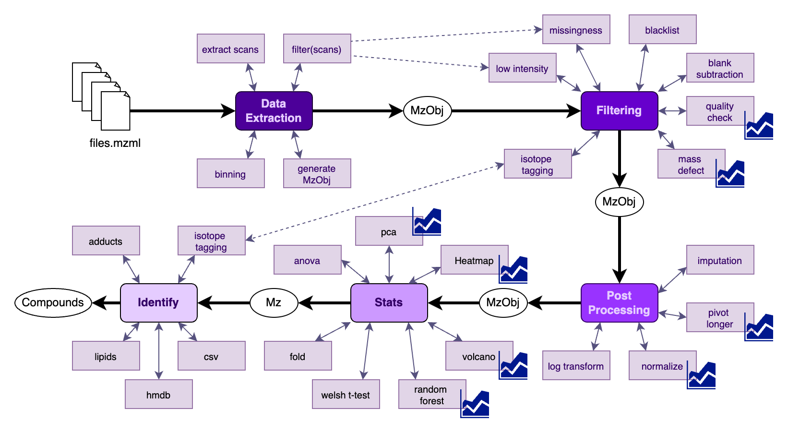

# MeDUSA

MeDUSA is modular, customizable, and user friendly toolset in R to ease the data processing of Direct Infusion Untarged Single-cell Analysis.

## Running
### Via Dockerhub
Included is a dockerfile that compiles all R requirements, some common compound databases, and an Rstudio.
`docker pull thefollyllama/medusa`
`docker run -e PASSWORD=medusa -p 8787:8787 -v .:/home/rstudio/local thefollyllama/medusa`
in a browser navigate to "localhost:8787" usr:rstudio pwd:medusa
### Via Docker
It is suggested to run via dockerhub, as building the image can take over an hour. However, local build instructions can be found in the Dockerfile

## Data Structures
MeDUSA's modularity is achived via common data objects that are interchangeable.

### MZ-OBJ: The standard "MZ Object"
DataFrame where:
  - Rownames = Float: MZ
  - Colnames = String: sample_names
  - Data     = Float: Intensities

### MzT-OBJ: An "MZ Object" rebranded to represent scan-time.
DataFrame where:
  - Rownames = Float: MZ
  - Colnames = Float: ScanTime
  - Data     = Float: Intensities

### mzLog-OBJ: A log2 of "MZ Object."
DataFrame where:
  - Rownames = Float: MZ
  - Colnames = String: sample_names
  - Data     = Float: log2(Intensities)

Programatically: the methods for [mz-obj, mzT-obj, mzLog-obj] are all interchangeable....proceed with caution.

### mzLong-OBJ: A pivot longer of an "MZ Object"
DataFrame where columns are:
  - Float : MZ
  - String: ScanTime
  - Float : intensity

### METADATA: The standard "MZ Metadata object"
Dataframe required columns are:
  - Integer: measurement
  - String : sample_name (Must match above)
  - String : type (i.e. cell, media_cell, solvent)
  - String : phenotype
Additional columns could be helpful. Such as:
  - Integer: time
  - Integer: plate
  - Integer: cell_count
  - String : sampler
  - String : polarity
  - String : sampling_day
  - String : filtered_out

## R Project Structure
MeDUSA's files and methods are named to quickly identify input and output expectations.

### Primary files:
**file_name** : [suggested order]_[input object type]_[description].R
i.e. "2_mz_quality_check.R"

**public function** : [input_object]_[category]_magic
suggested method to handle everything in the file category (i.e. "mz_post_magic")

**public function** : [input object]_[subcategory]_[description]
(i.e. "mzlog_analysis_fold")

**private funciton** : [type].[description]
(i.e. "extract.binning")

### Support files
file: z_[description].R
  - common methods written by ehetzel
file: zz_[description].R
  - common methods written by others

## Support Project Structure
Also in this repo are Rproj adjacent tools

**docs**: JOSS paper materials
**examples** : a small set of data and an example of ideal usage
**scripts** : mostly data massaging scripts to provide compound data in the docker container
**validation**: TBD
**Dockerfile**: An optimized docker image ~2.5gb
**Dockerfile_unoptimized**: More debug friendly dockerfile ~12gb
